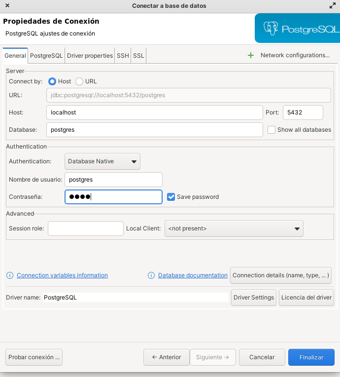

# 🐳TALLER DOCKER THE BRIDGE 🐳

> **En el taller de hoy vamos a ver lo básico que necesitamos saber para saber usar Docker en un entorno profesional sin tener conocimientos previos sobre la herramienta.**
> 

# 1. ¿Qué es Docker?

## Definición

> **Docker es un sistema operativo para contenedores. De manera similar a cómo una máquina virtual virtualiza (elimina la necesidad de administrar directamente) el hardware del servidor, los contenedores virtualizan el sistema operativo de un servidor.**
> 

## Características

- **MISMO ENTORNO**
    
    La idea de Docker es que te permite correr tu aplicación siempre en un mismo entorno. Esto quiere decir que todas las dependencias van a estar dentro de un mismo contenedor.
    
    Nosotros vamos a poder mover un contenedor entre una máquina u otra y nuestras dependencias siempre van a estar ahí dentro.
    
- **SANDBOX**
    
    Vamos a poder utilizar nuestro código independientemente del ordenador, sistema operativo o entorno en el que nos encontremos.
    
- **FÁCIL DE MOVER**
    
    Siempre funciona.
    

## Docker y Virtual Machine (VM)

Seguramente algunos de vosotros os estéis preguntando cuál es la diferencia entre Docker y una Virtual Machine.


- **Similitudes**
    
    La idea de una máquina virtual es que nuestras aplicaciones pueden correrse dentro de un sistema operativo y, para crear una nueva aplicación, vamos a tener que correr otra máquina virtual.
    
    Todo ello corre sobre un hypervisor y siempre sustentado por una infraestructura que puede ser, por ejemplo un servidor físico o una instancia en la nube.
    
- **Diferencias**
    
    La idea de Docker es que vamos a sacar una de esas capas de la ecuación y vamos a correr nuestra app junto con los archivos que necesita esa aplicación para correr.
    
    El kernel que corre cada uno de esos contenedores tiene un host compartido.
    
    Esto quiere decir que el host te da el kernel para que se corran mis aplicaciones.
    
    Esto quiere decir que un contenedor de Windows solo puede correr en un servidor que tenga un kernel de Windows.
    

**Imagino que ahora te estarás preguntando**

> ¿**Entonces cómo vamos a correr contenedores Linux en una máquina con windows o con mac?**
> 

Cuando nosotros descargamos Docker Desktop, lo que estamos haciendo es crear una pequeño kernel que nos permite correr esos contenedores sobre ese kernel.

Simplemente esto nos viene bien a nivel de aprendizaje y desarrollo a pequeña escala, por lo que no debería preocuparnos el hecho de que tal vez nos tarde un poco más o ciertos procesos puedan ejecutarse más lentamente.

Lo ideal es correr un servidor Linux con servidores de Linux y así con cada sistema operativo.


# 2. Instalación de Docker

Para instalar docker:

```bash
https://www.docker.com/get-started
```

En función de nuestro sistema operativo, tendremos que descargar una versión de escritorio. Para los usuarios de Linux, entiendo que sabrán cómo apañárselas.

# 3. Funcionamiento de Docker

Básicamente Docker va a hacer lo siguiente:

> **Correr un contenedor a partir de una imagen**
> 

## **¿Qué es una imagen de Docker?**

> **Una imagen Docker es un archivo, compuesto por múltiples capas, que se utiliza para ejecutar código en un contenedor Docker. Estas imágenes son las plantillas base desde la que partimos ya sea para crear una nueva imagen o crear nuevos contenedores para ejecutar las aplicaciones.**
> 


[Más info](https://docs.docker.com/get-started/docker-concepts/building-images/understanding-image-layers/)

**ESTRUCTURA**

- Sistema operativo.
    1. Ubuntu
    2. Debian
    3. Fedora
- Interpretes y compiladores
    1. GCC
    2. Java
    3. Python
- Servicios
    1. Apache
    2. Php
    3. Mysql
- App
    1. Dependencias
    2. Nuestro código

El código junto con las librerías y el sistema operativo son los elementos que componen nuestra imagen.

## ¿Cómo lanzamos esa imagen?

Para generar imágenes generamos lo que se conoce como Dockerfile

**DOCKERFILE**

> Archivo que contiene las instrucciones para crear nuestra imagen.

Esencialmente es una receta que indica como se debe contruir la imagen del contenedor..

```docker
FROM xxx #Partiendo de esta imagen

COPY . . # Copia estos ficheros

RUN zzz # Y ejecuta esto al ser instanciada
```

Después de crear ese **Dockerfile**, corremos el comando que se llama `docker build` para generar esa imagen.

Si queremos correr esa imagen para crear este contenedor, utilizamos el comando `docker run` 

> **Probablemente, lo más interesante que tiene docker es que podemos correr un contenedor ejecutado por nosotros o bien podemos cargar una imagen que ha sido creada por otra persona.**
> 

Esto es genial porque nosotros podemos bajarnos una imagen ya creada y modificarla teniendo en cuenta las especificaciones de nuestra app.

### Ejemplo

Si queremos correr nuestro código Wordpress, en lugar de bajar una imagen de ubuntu, instalar todas las dependencias y demás, simplemente podemos bajarnos una imagen de Wordpress y modificarla como queramos.

https://hub.docker.com/search?q=wordpress

# Follow-Along

> # AVISO PARA MAC 🍏
>
> Es posible que tengáis un error a la hora de lanzar vuestros contenedores e imágenes por un tema de **PERMISOS.**
>
> Para solucionarlo, tenéis que seguir los siguientes **PASOS:**
>
>- **HABILITAR PERMISOS EN MAC**
>    
>   Abrir el menú 🍏 e ir a **"Preferencias del sistema"**
>   
>    Seleccionar **"Seguridad y Privacidad"**
>    
>    Hacer click en el **Candado** e introducir vuestra contraseña de usuario.
>    
>    En la barra desplegable de la izquierda, elegir **ACCESO TOTAL AL DISCO**
>    
>    Añadir una seleccionando el icono ➕
>    
>    Ir a Aplicaciones → Utilidades → Terminal
>    
>    **RELANZAR LA TERMINAL**
>    
>    [https://osxdaily.com/2018/10/09/fix-operation-not-permitted-terminal-error-macos/](https://osxdaily.com/2018/10/09/fix-operation-not-permitted-terminal-error-macos/)
    
## Correr una imagen

Vamos a correr una imagen a través de terminal. Si las consolas de Windows no os funcionaran podéis usar el _git bash_.

```bash
docker run postgres
```

**¿Cómo sé yo que hay una imagen que se llama *postgres?***

Esto lo tenemos en lo que se conoce como el registro de Docker.

Es el lugar en el que se hospedan estas imágenes.

```python
# Si no lo habéis hecho aún, tenéis que crearos vuestro usuario de Dockerhub
https://hub.docker.com/
```

Si aquí buscamos ***postgres***, vamos a tener todos los detalles sobre esta imagen, así como sus distintas versiones.

Si esta imagen no la tenemos previamente descargada, lo que se va a hacer es descargarla de Dockerhub, por eso veremos cómo se ejecutan varios comandos pull.

**Si queremos utilizar una versión concreta de una imagen, podemos añadirle un tag**

Si no especificamos, se va a descargar latest

Por ejemplo:

```python
# Es una buena práctica especificar la versión
docker run postgres:latest
```

Como veis, os habrá dado un error porque se exige que se añada un comando a correr.

En este caso, tenemos que mandarle una variable de entorno al contenedor para que se configure. Si hacemos lo que nos indica...

**FUNCIONA!!**

Como veis, yo no tengo descargado Postgres en mi ordenador ni en ningún sitio. Simplemente creo esa imagen de Postgres con la información necesaria para que mi app funcione.

Cuando se descarga una imagen, vamos a ver que cada una es un listado de capas, que vienen identificadas con su valor hash.

Nosotros podemos abrir una nueva terminal y correr una imagen de Postgres con una versión distinta en otro contenedor dentro de un mismo servidor y no vamos a tener ningún problema.

## PostgreSQL + docker

Crear y lanzar contenedor PostgreSQL

- Paso 1 - Te descarga imagen y carga el contenedor de una vez

```python
docker pull postgres
```

Podemos validar que la imagen existe en nuestro sistema:

```python
docker images
```

- Paso 2: ejecutamos una instancia

```python
# Es una buena práctica especificar la versión
docker run --name postgres-db -e POSTGRES_PASSWORD=1234 -p 5432:5432 -d postgres
```

Podemos validar que la instancia se está ejecutando

```python
docker ps
```

Incluso ver sus logs
```python
docker logs postgres-db
```

- Paso 3 : Acceder por consola al contenedor Postgresql

```python
docker exec -it postgres-db bash
```

Para poder ejecutar el motor de PSQL tenemos que cambiarnos de usuario, en este caso usaremos el usuario "postgres".

```python
 psql -U postgres
```

- Comandos SQL

Creación de la BBDD y tablas (hay que definir la bbdd y tablas del proyecto)

```sql
CREATE DATABASE bbdd;

-- Conectarse a la BBDD
\c bbdd

-- Authors

CREATE TABLE authors (
  id_author serial NOT NULL PRIMARY KEY,
  name varchar(45) NOT NULL,
  surname varchar(45) NOT NULL,
  email varchar(100) NOT NULL UNIQUE,
  image varchar(255)
);

-- Entries

CREATE TABLE entries (
  id_entry serial NOT NULL PRIMARY KEY,
  title varchar(100) NOT NULL,
  content text NOT NULL,
  date date DEFAULT CURRENT_DATE,
  id_author int,
  category varchar(15),
  FOREIGN KEY (id_author) REFERENCES authors(id_author)
);

-- Inserta varios autores

INSERT INTO authors(name,surname,email,image) VALUES
('Alejandru','Regex','alejandru@thebridgeschool.es','https://randomuser.me/api/portraits/thumb/men/75.jpg'),
('Guillermu','Develawyer','develawyer@thebridgeschool.es','https://randomuser.me/api/portraits/thumb/men/78.jpg'),
('Albertu','Henriques','albertu@thebridgeschool.es','https://randomuser.me/api/portraits/thumb/men/80.jpg'),
('Alvaru','Arias','alvaru@thebridgeschool.es','https://randomuser.me/api/portraits/thumb/men/70.jpg'),
('Birja','Ryvera','birja@thebridgeschool.es','https://randomuser.me/api/portraits/thumb/men/72.jpg'),
('Muchelle','Ualis','muchelle@thebridgeschool.es','https://randomuser.me/api/portraits/thumb/women/70.jpg'),
('Christianu','City','christianu@thebridgeschool.es','https://randomuser.me/api/portraits/thumb/men/45.jpg');

-- Insertar una entry del blog

INSERT INTO entries(title,content,id_author,category) VALUES ('Nos vamos de pizzas al patio','The bridge invita a pizzas por reto de tripus','1','Sucesos');
```

Todo esto también podremos hacerlo conectándonos con un gestor de base de datos como DBeaver indicando los parámetros que conocemos para esta instancia del servicio:



> Cheatsheet comandos por consola:
> 
> [https://www.postgresqltutorial.com/postgresql-cheat-sheet/](https://www.postgresqltutorial.com/postgresql-cheat-sheet/)
> 
> [https://www.valentinog.com/blog/psql/](https://www.valentinog.com/blog/psql/)

Al finalizar nuestro ejercicio podremos para el contenedor

```python
docker stop postgres-db
```

Y si no quisiéramos volver a usarlo, eliminarlo.

```python
docker rm postgres-db
```

## Comandos más comunes en Docker

```python
# Solamente va a descargar las imágenes
docker pull 

# Para ver todas las imágenes que tenemos
docker images

# Para ver los contenedores que estamos corriendo en este momento
docker ps

# Para ver todos los contenedores que corrimos y los que están en ejecución
docker ps -a

# Ver los logs del contenedor
docker logs <container_id>
docker logs <container_nam e>

# Ejecuta un comando en un contenedor que ya está corriendo
docker exec -it <container_id> # crear una sesión interactiva. Con la t creamos una shell

# Para parar un contenedor
docker stop <container_id>

# Para correr un contenedor en segundo plano
docker run -d <image>

```

## Creando nuestra imagen

Cuando creamos una aplicación y queremos garantizar que pueda ejecutarse en cualquier entorno, crear un contenedor puede ser la mejor opción. Así, nos abstraemos del entorno, hardware, versión de python... todo lo que pueda variar y hacer que nuestra aplicación falle.

**PARTES DE UN DOCKERFILE**

[Qué es DockerFile](https://openwebinars.net/blog/que-es-dockerfile/)

- **FROM** → se especifica la versión exacta de la imagen que queremos.
- **WORKDIR** → dentro del contenedor voy a crear una carpeta que se llama /src
- **COPY** → con este comando lo que estoy haciendo es pasar todo lo que tengo en el directorio en el que se encuentra el Dockerfile **(CON EL PRIMER PUNTO)** al contenedor en el directorio que le hemos creado **(EL SEGUNDO PUNTO)**
- **RUN** → nos permite ejecutar comandos dentro del contenedor, por ejemplo, instalar paquetes y librerías.
- **CMD** → a diferencia del RUN, cmd es lo que nos permite accionar ese contenedor a través de línea de comandos.
- **EXPOSE** → indica a la aplicación en que puerto se debe ejecutar

### CONSTRUIR UNA IMAGEN

Estando en la ubicación de nuestro dockerfile, para construir nuestra imagen, simplemente tenemos que hacer lo siguiente:

```python
# -t es para poner un tag que indique la versión (latest si no)

#!IMPORTANTE EL PUNTO FINAL
docker build -t <nombre-contenedor>:<tag> .

# Ejemplo
docker build -t mysuperapp:v1 .
```
### Docker Push

Podemos hacer nuestra imagen accesible a nuestros compañeros, y esto se realiza bien dando acceso al Dockerfile para que ellos construyan su propia imagen, lo cual puede no ser muy operativo; o bien, subiendo nuestra imagen al DockerHub. Así, unicamente tendrán que ejecutar el comando _run_ para descargar y ejecutar nuestra aplicación.

Para esto deberemos crear la imagen con el nombre de nuestro espacio en dockerhub

```python
docker build -t <usuario-docker-hub>/<nombre-contenedor>:<tag> .
```

Posterior deberemos registrar nuestra máquina para que dockerhub sepa quienes somos:

```python
docker login
```

Y entonces podremos hacer _push_ de la imagen para que todo el mundo pueda acceder a ella:
```python
docker push <usuario-docker-hub>/<nombre-contenedor>:<tag>
```

## DOCKER COMPOSE

Es la forma en la que podemos orquestar varios contenedores

- [microservices](https://www.redhat.com/es/topics/microservices)

Seguro que muchos de vosotros estaréis pensando:

> **¿Cómo carajo me voy a acordar de todos esos comandos?**
> 

Seguramente ya os ha pasado que si os equivocáis en una línea o un espacio o guion, probablemente no os funcione.

Pero la gente de Docker es maravillosa e inventó una cosa llamada **Docker compose**.

Pero antes de nada lo que vamos a hacer es frenar estos dos contenedores.

Ahora lo que vamos a hacer es abrir un `docker-compose.yaml` (podéis hacerlo desde terminal o en la propia carpeta de archivos).

### PARTES DE UN DOCKER COMPOSE

Como podéis ver, el comentario del docker compose son la serie de comandos que hemos metido a través de terminal.

Vamos a ir paso a paso viendo qué es cada cosa.

Al crear un docker-compose ya se crea una propia red, por lo que no va a hacer falta habilitar una network, sino que lo va a hacer por defecto.

Este es un archivo yaml, similar a un JSON que sigue la lógica clave-valor.

Podemos diferenciar dos secciones importantes:

- _version_
- _services_
    - Es donde declaramos los servicios que vamos a correr dentro de Docker compose.
    - Nos permite instanciar varios contenedores a través de un solo archivo que crea una red para todos ellos.
    - Tenemos la app y mongodb:
        - _image_: la imagen que vamos a ejecutar.
        - _ports_: los puertos expuestos.
        - _environment_: donde declaramos todas las variables de entorno.

**Para lanzar**

Estando en la carpeta en la que se encuentra `docker-compose.yaml` 

```jsx
docker-compose up
```

**Para parar**

```jsx
docker-compose down
```

**Para eliminar**

```jsx
docker-compose rm
```

**Otros ficheros**

```jsx
docker-compose -f <nombre-fichero>.yml
```
